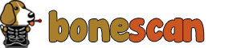

# BoneScan
## A vulnerability scanner for the BeagleBoard

### What is BoneScan?
Bone scan is a vulnerability scanner that offers users a detailed information on the security of their BeagleBoard in an easy to read report format. BoneScan is intended to be run from an administrative device separate from the BeagleBoard. The administrative device communicates with the Beagle Board via SSH.

### Installation
* Bonescan required python 3.6

* `git clone https://github.com/melvinofida/BoneScan.git`

* `pip install -e .`
### How do I use BoneScan?
* Connect your BeagleBoard to the same subnet as your administrative device.
* On the administrative device, run BoneScan.py as shown below.

* `python BoneScan.py -i {ip address of BeagleBoard} -u {username of BeagleBoard}`
* The scan may take a while. Once it is complete, the report will be saved as an html
 file in the report directory.
